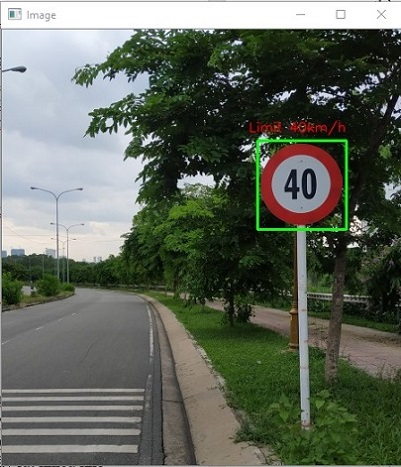

##### Môn: CS114.K21
# **Machine Learning Capstone: Phát hiện biển báo giao thông phổ biến trong Làng Đại học**
###
### Tổng quan
Ngày nay, cơ sở hạ tầng giao thông ngày càng phát triển, việc phát hiện biển báo để cung cấp thông tin đến người tham gia giao thông là một điều rất quan trọng. Tận dụng những kiến thức đã được học ở môn Machine Learning, kết hợp với những điều gần gũi với đời sống. Nhóm chúng em đã chọn đề tài “Phát hiện các loại biển báo giao thông phổ biến ở Làng Đại học” làm đề tài nghiên cứu. Giúp mọi người có thể hiểu đâu là biển báo giao thông và chúng có ý nghĩa thế nào.

### Mô tả  bài toán:
1. Input: Một bức ảnh có chứa biển báo bất kỳ.
2. Output: Ảnh input với bounding box khoanh vùng có biển báo và tên biển báo

 

### Để xây dựng được mô hình như yêu cầu bài toán đó, ta cần phải xây dựng 2 mô hình:
1. Phát hiện biển báo(*).
2. Phân loại biển báo(* *).

###
---
###
## Mô hình phát hiện biển báo:
1. Quét bức ảnh input bằng một cửa sổ trượt từ trái sang phải và từ trên xuống dưới.
2. Trích xuất đặc trưng ở mỗi vùng scan qua trên hình.
3.	Sử dụng model phân loại biển báo(* *) để dựng đoán xem vùng đó có chứa biển báo hay không.
4.	Tổng hợp lại các vùng có chứa biển báo thỏa mãn để có một vùng duy nhất (Final bounding boxes) 

### Xây dựng Scanner
Để có thể tìm được vật thể chúng ta cần tìm, ta cần phải quét toàn bộ trên bức hình. Vì kích thước của vật thể có thể nằm bất cứ đâu trên hình và có kích thước ngẫu nhiên. Cho nên chúng ta cần xây dụng “scanner” theo 2 tiêu chí sau:
- Kích thước ảnh quét: Ta cần phải quét trên bức ảnh với nhiều kích thước khác nhau để có thể tìm ra được vật thể. Gọi tắt là kỹ thuật “Image Pyramid”.

- Phạm vi quét: Ta cần phải quét phạm vi toàn bức ảnh. Cho nên cần xây dựng một cửa sổ trượt để quét lần lượt toàn bộ bức ảnh theo chiều từ trên xuống và trái sang phải.(Sliding window)

### Trích xuất đặc trưng ở mỗi vùng scan trên hình
-	Ta sẽ sử dụng HOG((histogram of oriented gradients) để trích xuất đặc trưng trên những vùng mà cửa sổ trượt qua.
-	HOG là một feature descriptor được sử dụng trong computer vision và xử lý hình ảnh, dùng để detec một đối tượng. Các khái niệm về HOG được nêu ra từ năm 1986 tuy nhiên cho đến năm 2005 HOG mới được sử dụng rộng rãi sau khi Navneet Dalal và Bill Triggs công bố những bổ sung về HOG. HOG tương tự như các biểu đồ edge orientation, scale-invariant feature transform descriptors (như sift, surf ,..), shape contexts nhưnghog được tính toán trên một lưới dày đặc các cell và chuẩn hóa sự tương phản giữa các block để nâng cao độ chính xác. HOG được sử dụng chủ yếu để mô tả hình dạng và sự xuất hiện của một object trong ảnh.

### Dự đoán đối tượng trong cửa sổ trượt
-	Ta sẽ sử dụng một model đã được train về các loại biển báo phổ biến trong làng đại học để dự đoán xem có biển báo trong cửa sổ hay không. 
-  Sau khi dự đoán, nếu có đối tượng biển báo trong hình thì ta sẽ tiến hành trả về tọa độ vị trí của đối tượng.

- Model sử dụng trong bài toán này: SVM và KNN

#### Support Vector Machine là gì?
- Là thuật toán thường được áp dụng trong bài toán phân lớp, áp dụng cho cả dữ liệu tuyến tính và không tuyến tính.
- Mục tiêu: tìm được một mặt phân cách (siêu phẳng trong không gian đa chiều) sao cho tất cả các điểm dữ liệu cùng loại đều nằm về một phía riêng biệt của mặt phân cách đó.

### Tổng hợp lại các khung viền
-  Trong lúc trượt cửa sổ, tùy thuộc vào bước nhảy, sẽ có nhiều cửa sổ thỏa mãn điều kiện có chứa biển báo. Cho nên chúng ta cần phải chọn ra một cửa sổ tối ưu nhất.
-  Để làm được điều đó chúng ta sẽ sử dụng kỹ thuật Non-maximum Suppression (NMS)

 

#### Non-maximum Suppression (NMS)
##### Input: Một danh sách B là các cửa sổ thỏa mãn, cùng với các xác suất dự đoán tương ứng và cuối cùng là ngưỡng overlap N.
##### Output: Danh sách D các cửa sổ tối ưu cuối cùng.
Các bước thực hiện: 
  -	Chọn cửa sổ có xác suất dự đoán cao nhất. Xóa nó khỏi B và đưa nó vào D. 
  -	Tính giá trị IOU(Intersection over Union)(Giá trị IOU được sử dụng để tính toán sự trùng lặp của 2 khung cửa sổ) của cửa sổ mới được chọn với những cửa sổ còn lại. Nếu giá trị IOU lớn hơn ngưỡng N thì ta sẽ xóa nó khỏi lớp B
  -	Tiếp tục chọn cửa sổ có xác suất dự đoán cao nhất còn lại. Quay về bước 2
  -	Lặp cho tới khi không còn giá trị nào trong B

###
---
###
## Mô hình phân loại biển báo

Mô hình này mục đích là để đưa ra kết quả dự đoán xem trong cửa sổ trượt đó có biển báo hay không và chúng thuộc loại nào.

### Các bước xây dựng:
1. Thu thập dữ liệu
2. Xử lý dữ liệu
3. Phân chia dữ liệu Training và Testing
4. Chọn model và training
5. Đánh giá mô hình và nhận xét

### Thu thập dữ liệu:
Dữ liệu là những bức ảnh biển báo giao thông nhóm tự chụp bằng điện thoại. Tùy thuộc vào tần suất xuất hiện nên số ảnh ở mỗi lớp có sự chênh lệch
Ảnh không chứa biển báo: SceneClass13 gồm 3000 tấm

#### Số lượng
Bao gồm 6 classes và 1 class ảnh ngoại cảnh(ảnh không chứa biển báo)
##### Training:
- Biển Speed limit (40km/h): 109 tấm
- Biển W.207b sign: 108 tấm
- Biển Pedestrians:88 tấm 
- Biển No entry: 92 tấm
- Biển Keep right: 66 tấm
- Biển Roundabout mandatory: 41 tấm
- SceneClass13: 3000 tấm(chỉ dùng 1000 tấm)

##### Testing:
- Biển Speed limit (40km/h): 18 tấm
- Biển W.207b sign: 24 tấm
- Biển Pedestrians: 27 tấm 
- Biển No entry: 11 tấm
- Biển Keep right: 8 tấm
- Biển Roundabout mandatory: 6 tấm
- SceneClass13: 156 tấm

### Xử lý dữ liệu
Xử lý dữ liệu bao gồm các bước như sau:
1.	Cắt vùng có chứa biển báo ra khỏi ảnh ban đầu bằng công cụ “Crop” trong Image trên Windows 10.

2.	Chuyển ảnh từ ảnh màu RGB sang ảnh xám.

4.	Resize bức ảnh về chung một kích thước duy nhất là 64x64.
5.	Sử dụng HOG để trích xuất đặc trưng cho bức ảnh. Ta sẽ được các vector (8100x1) để chuẩn bị cho bước training.

### Chọn model và training
Dùng model SVM và KNN để training. Model được import từ scikit-learn.
Ở SVM cần quan tâm tới các hyperparameters như sau:
-	C: 0.01
-	Probability=true
-	Random_state=42
-	Kernel=”linear”

Gọi phương thức model.fit để thực hiện training. Sau khi training xong ta sẽ lưu model lại cho những lần dự đoán tiếp theo.

### Dự đoán trên tập ảnh test
- Ta sẽ đánh giá model của chúng ta bằng tập ảnh “Test”. 
- Tập này bao gồm 20% số ảnh đã chụp được của các lớp. 
- Tiến hành xử lý ảnh trên tập ảnh “Test” như ở tập training. Sau đó gọi phương thức model.predict ta được kết quả như sau:

#### SVM

#### KNN

### Đánh giá mô hình
#### Nhận xét: 
- Ta có thể thấy hai mô hình đạt độ chính xác trên 90%. Sở dĩ đạt độ chính xác cao như vậy là vì những bức ảnh training và testing đã được pre-processing. Chỉ chừa mỗi phần có chứa biển báo. Tăng sáng và độ tương phản cho một số bức ảnh tối hay độ tương phản thấp.
- Mô hình SVM đạt độ chính xác cao hơn vì: 
  1. SVM hoạt động tốt với kiểu dữ liệu nhiều chiều. Trong bài này mỗi vector sau khi rút trích HOG đều là vector có số chiều rất lớn.
  2. KNN sai nhiều ở hai loại biển báo thứ 2 và thứ 3. Đây là 2 loại biển báo khá tương đồng nhau. Vì vậy KNN khi predict nó sẽ đưa ra kết quả sau khi tính khoảng cách giữa các vector, điều đó dẫn tới việc sẽ có nhiều nhầm lẫn giữa 2 loại biển báo đó nên hiệu suất bị giảm đi đáng kể thay vì training như SVM.
- Ở một số loại biển báo như biển báo W.207b và Pedestrians có độ chính xác thấp bởi vì chúng đề là những loại biển báo nguy hiểm có hình dạng là tam giác. Cho nên phần ROI chỉ chiếm một nửa bức ảnh(Các biển báo tròn chiếm 79% bức ảnh). Vậy nên các loại biển báo nguy hiểm chứa vùng nhiễu lớn hơn các loại biển báo tròn. Điều đó đã làm giảm hiệu suất khi chúng ta trích xuất HOG và training model bằng SVM.
- Ở bước trượt cửa sổ để dự đoán biển báo. Có một số vấn đề như sau:
  1.	Khi ta để bước nhảy của cửa sổ đó bé hơn hoặc bằng 8 và pyramid-scale<1.25 thì hầu hết những biển báo đều được phát hiện ra vị trí trong khung hình. Tuy nhiên chúng lại có nhược điểm là tốc độ phát hiện ra biển báo rất chậm. Ngược lại khi ta để bước nhảy lớn hơn 8 hoặc pyramid-scale > 1.25 thì bắt đầu có hiện tượng model không phát hiện ra vị trí biển báo. Nguyên nhân là do khi để bước nhảy lớn, cửa sổ của chúng ta có thể đã skip hoặc nhảy qua một phần vùng có chứa biển báo, hoặc với việc để pyramid-scale >1.25 thì kích thước ảnh giảm xuống đột ngột nên khi trích xuất HOG ở vùng đó để dự đoán thì kết quả dự đoán rơi vào nhãn -1 (Nhãn ngoại cảnh). Vậy sau quá trình thực nghiệm và điều chỉnh, thì nhóm em đã chọn window-step = 8 và pyramid-scale = 1.25.
  2.	Trước khi dự đoán, vì ảnh input có khả năng là một bức ảnh có độ phân giải lớn, nên nếu ta tìm kiếm trên bức ảnh đó sẽ cho ra thời gian tìm kiếm lâu, vậy nên để giảm tối đa chi phí tìm kiếm, ta sẽ resize bức ảnh về kích thước nhỏ nhất là 400 cho chiều dài hoặc chiều rộng(giữa nguyên tỉ lệ ảnh).
  3.	Mặc dù vậy thì thời gian tìm kiếm vẫn diễn ra trong thời gian lâu. Xấp xỉ 20s cho một bức ảnh. Đây là nhược điểm lớn nhất của mô hình.
---
## Thử nghiệm trên những bức ảnh mới
Thử test trên những bức ảnh chụp dọc đường hoặc một số hình ảnh trên mạng.

 

 

Tuy nhiên có nhiều trường hợp bị sai hoặc không tìm ra biển báo

 

Nguyên nhân chính:
- Vùng chứa biển báo quá nhỏ so với bức ảnh
- Biển báo chưa có trong dataset bị nhận nhầm với những biển báo có trong tập training vì hình dáng khá giống nhau
- Góc chụp nghiêng nhiều so với những bức ảnh mà model được training

---
## Tài liệu tham khảo
1. SVM: https://machinelearningcoban.com/2017/04/09/smv/
2. HOG: https://viblo.asia/p/tim-hieu-ve-phuong-phap-mo-ta-dac-trung-hog-histogram-of-oriented-gradients-V3m5WAwxZO7
3. Sliding window: https://www.pyimagesearch.com/2015/03/23/sliding-windows-for-object-detection-with-python-and-opencv/
4. NMS: https://towardsdatascience.com/non-maximum-suppression-nms-93ce178e177c
5. Object detection: Chapter 2 PyimageSearch Gurus - Adrian Rosebrock
6. Dataset 13 Natural Scene Categories: http://vision.stanford.edu/resources_links.html
